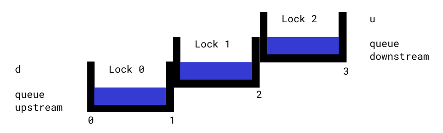

# Canal de Panamá

## Introducción

¡Los yanquis finalmente devuelven el canal! Panamá recupera la soberanía del territorio, y ya no hay más bases militares. En particular, el canal pasa a manos panameñas.

Los americanos tienen desarrollado un sistema de control y un simulador. Sin embargo, los programadores eran tejanos, y como buenos tejanos, no probaron nada. Nosotros no podemos dejar uno de los principales motores de nuestra economía expuesto a errores inesperados, y por eso, vamos a desarrollar un conjunto de tests para verificar que el software legado esté en condiciones apropiadas. Además, tenemos planeada una expansión del canal, y es importante tener un conjunto de pruebas sólido para probar la expansión.

El sistema de control del canal es complejo. Nuestros compañeros de la empresa se adelantaron, y recopilaron información del funcionamiento del programa además de entrevistas a sus desarrolladores. Esta información es vital para construir el conjunto de tests, y está detallada a continuación.

## Funcionamiento

Toda esta sección explica el funcionamiento del canal. Pueden probarlo con el simulador, `canal_diagram.py`. A continuación un diagrama de las esclusas que vamos a usar para explicar el software.



### Estado del Canal

El componente principal del sistema de control del canal es el estado. Este es un diccionario que cuentan con toda la información de las esclusas en un determinado momento. El estado inicial del canal es el siguiente:

```python
{
    "locks": ["","",""],
    "locks_water_level": ["low","low","low"],
    "queue_upstream": [],
    "queue_downstream": [],
    "gates": [False,False,False,False],
    "direction": "upstream",
    "control": [],
    "open": True
}
```

¿Pero qué es cada cosa?
- **locks**: Lista de 3 posiciones, una para cada esclusa (0,1,2) como están en el diagrama. Si hay algún barco en la esclusa, aparece su nombre en la posición correspondiente.
- **locks_water_level**: Lista de 3 posiciones, una para cada esclusa (0,1,2) como están en el diagrama. Representan el nivel del agua en dicha esclusa. Hay 4 opciones de nivel, *high*, *low*, *draining*, *filling*.
- **queue_upstream**: Lista. Contiene los barcos esperando para entrar al canal desde el punto más alto, *upstream*, del canal.
- **queue_downstream**: Lista. Contiene los barcos esperando para entrar al canal desde el punto más bajo, *downstream*, del canal.
- **gates**: Lista de 4 posiciones, una para cada compuerta (0,1,2,3). La 0 es entre el punto más bajo del canal y la esclusa 1, la 1 es entre la esclusa 1 y la 2, la 2 es entre la esclusa 2 y la 3, y la 3 es entre la esclusa 3 y el punto más alto del canal. Si la compuerta está abierta, el valor es True, si está cerrada, el valor es False.
- **direction**: Dirección en la que está operando el canal. Puede tomar dos valores, *upstream* y *downstream*.
- **control**: Lista de comandos a ser ejecutados por el control. Se va a explicar más en la fase I.
- **open**: Booleano que dice si está abierto o no el canal. Si el canal está cerrado, los barcos de las filas rio abajo o rio arriba no pueden ingresar al canal.

### Fase I: Ejecutar comandos de control pendientes

Antes, tenemos que entender que es el control, una de las partes principales del estado. El control es una lista de tuplas de la forma `(<tiempo>, <comando>)`, que simulan acciones que llevan tiempo, y el programa debe actualizar el estado del canal cuando dichas acciones se completan. El *tiempo* es simplemente un entero que representa la cuenta regresiva hasta necesitar ejecutar el comando. En la fase I, se ejecutan comandos cuyo tiempo es 0. Al ejecutarlos se eliminan de la lista de control ¿Pero que tipos de comandos hay?
1. **Comando move**: Este tiene la forma de `"move <origen> <destino>"`. Este comando representa la finalización del movimiento de un barco, y al ejecutarse mueve el nombre del barco de `<origen>` a `<destino>` y cierra (`False`) la compuerta entre origen y destino. Por ejemplo, el comando `"move qd 0"` mueve el barco de la fila río abajo, es decir saca el primer elemento de *queue_upstream* (recuerden que el nombre está dado por la dirección a recorrer y no el lugar donde están) y lo pone en la esclusa 0.Además, cierra la compuerta 0.

2. **Comando level**: Este tiene la forma de `"level <esclusa> <nivel>"`. Este comando representa la finalización de un cambio de nivel en una esclusa, y al ejecutarse cambia el nivel de la esclusa referida al nivel deseado. Por ejemplo, el comando `"level 1 high"` setea el nivel de la esclusa 1 en *high*.

3. **Comando direction**: Este tiene la forma de `"direction <abrir> <dirección>"`. Este comando representa el intento de cambio en la dirección del canal. Cuando se ejecuta, primero se chequea si el canal está vacío. Si la respuesta es no, se cierra el canal (`<canal-state>["open"] = False`) a la espera de que los barcos restantes despejen el canal. En este caso, se agrega un comando de 1 minuto para ejecución el próximo ciclo y que vuelva a chequear si el canal está vacío, de la forma `(1,"direction <abrir> <dirección>")`. Si en cambio el canal está vacío, se cambia la dirección a la deseada, y si abrir es igual a "open", se reabre el canal (`<canal-state>["open"] = True`)

### Fase II: Mover barcos a través de las esclusas

Cuando ya hay barcos en las esclusas, hay toda una lógica para ver si un barco puede avanzar de esclusa o salir del canal, o hay que modificar los niveles de las esclusas.

Si la dirección es *upstream*, y el barco se encuentra en una esclusa con nivel bajo (*low*), se debe elevar el nivel del agua en la esclusa en la que está presente. Esto se hace cambiando el nivel de agua a *filling* y agregar el comando de elevar el nivel al control, que dura 10 minutos. El comando entonces sería `(10, level <esclusa> high)`. Para dirección *downstream*, ocurre lo mismo cuando está en una esclusa de nivel alto (*high*). Se debe bajar el nivel del agua, y esto se hace cambiando el nivel a *draining* y agregar el comando de bajar el nivel al control, que sería de la forma `(10, level <esclusa> low)`.

Cuando el barco está listo para pasar a la siguiente esclusa, es decir, en una esclusa de nivel alto (*high*) cuando la dirección es *upstream* o de nivel bajo (*low*) cuando la dirección es *downstream*, se chequean las siguientes cosas:
1. Si hay un barco en la siguiente esclusa, no se hace nada (al menos en términos de este barco, el otro barco puede realizar acciones como subir el nivel de su esclusa).
2. Si el nivel está *draining* o *filling* de la siguiente esclusa, tampoco puede hacer nada.
3. Si el nivel está alto (*high*) en el caso de que la dirección sea *upstream*, debemos bajarlo para que el barco pueda cambiar de esclusa. Esto es setear el nivel de la siguiente esclusa en *draining* y agregar el comando correspondiente, es decir `(10, level <esclusa-a-moverse> low)`. Si el nivel está bajo (*low*) en el caso de que la dirección sea *downstream*, debemos subrilo para que el barco pueda cambiar de esclusa. Esto es setear el nivel de la siguiente esclusa en *filling* y agregar el comando correspondiente, es decir `(10, level <esclusa-a-moverse> high)`.

Si el nivel está alto (*high*) en la esclusa menor, bajo (*low*) en la esclusa superior, y no hay barcos en la esclusa a la que quiere moverse (dependiendo la dirección del canal), el barco **PUEDE** avanzar a la siguiente esclusa. Cuando estas condiciones están dadas, ocurren las siguientes cosas en el estado:
1. Se abre la compuerta correspondiente (`True`) entre la esclusa actual y la esclusa siguiente o salida del canal
2. Se agrega al control el comando para iniciar la salida de esclusa, que dura 2 minutos. Es decir, se agrega de la forma `(2, "move <origen> <destino>")`

En el caso de querer salir del canal, esclusa 0 si es *downstream*, esclusa 2 si es *upstream*, alcanza solo con que el nivel de la esclusa actual sea el correcto: *low* para salir del canal por su extremo río abajo y *high* para salir del canal por su extremo río arriba. Para salir, es simplemente un caso particular de la salida descrita anteriormente. Se abre la compuerta correspondiente, y se agrega el comando de salida al control: `(2, "move 2 u")` cuando la dirección es *upstream*,  `(2, "move 0 d")` cuando la dirección es *downstream*.

Además, los barcos no pueden retroceder, es decir, moverse en una dirección opuesta a la dirección en la que está funcionando el canal actualmente.

### Fase III: Mover barcos al canal desde las filas

Finalmente, el programa ve si hay barcos que quieren entrar al canal. Obviamente, tiene que estar el canal abierto. Si la dirección es *upstream*, debo chequear si hay barcos en la fila, *queue_downstream* (*downstream* porque ingresan desde río abajo). En caso de que haya:
- Si la esclusa 0 está ocupada por un barco no hago nada.
- Si la esclusa 0 está *draining* o *filling* tampoco hago nada.
- Si la esclusa 0 está *high* debo bajar su nivel a *low*. Esto se hace igual que con las esclusas, setear el nivel a *draining* y agregar el comando `(10, level 0 low)`.
- Si la esclusa está *low*, puedo entrar al canal. Esto se hace abriendo la compuerta 0 y agregando el comando correspondiente, `(2, "move qd 0")`.

En el caso de dirección *downstream*, es muy parecido. Si hay barcos en la fila, *queue_upstream* (*upstream* porque ingresan desde río arriba):
- Si la esclusa 2 está ocupada por un barco no hago nada.
- Si la esclusa 2 está *draining* o *filling* tampoco hago nada.
- Si la esclusa 2 está *low* debo subir su nivel a *high*. Esto se hace igual que con las esclusas, setear el nivel a *filling* y agregar el comando `(10, level 2 high)`.
- Si la esclusa está *high*, puedo entrar al canal. Esto se hace abriendo la compuerta 3 y agregando el comando correspondiente, `(2, "move qu 2")`.


## Entrevista a empleados

Para saber más sobre el programa que estamos recibiendo, la empresa le hizo entrevistas a los empleados salientes. En particular, el siguiente fragmento trata sobre las dificultades que tuvieron al programar el sistema.

*Interviewer: What issues did you run into when developing the canal control system?*

*Engineer: Well, y'know, when we were developin' the software for the canal  control system, we ran into a good number of tricky issues. First off, makin' the control program handle movin' boats out of the canal was a real challenge. We had to design algorithms that could precisely calculate the timin' and coordination needed, and gettin' those calculations just right was no easy task.*

*Another big issue was gettin' the control program to work in both directions. The system had to be equally efficient whether boats were enterin' or exitin', which meant we had to write some pretty complex code to ensure smooth operations no matter the direction of travel.*

*And when it came to havin' multiple boats in the canal at the same time, well, that was a whole 'nother can of worms. The software had to manage multiple instances of the control process, prioritizin' and synchronizin' the movements to avoid collisions and ensure smooth traffic flow. Debuggin' and testin' those concurrent processes was particularly tough, and it took a lotta time and effort to get it right.*

## Librerías

Para hacer este tp, se necesitan 3 librerías: pytest para los tests, coverage para la covertura, y pygame para los diagramas. Fui bueno y armé un requirements.txt. Para instalar todas las dependencias, pueden correr el siguiente comando:

```bash
pip install -r requirements.txt
```

## Simulador

Para correr el simulador y ver interactivamente como funciona el canal, deben correr el archivo `canal_diagram.py`. ¿Qué es interactivo en el diagrama?

- El reloj, al hacer click avanza un minuto.
- Los `+` suman un barco a la fila del lado en que están.
- Las flechas a ambos lados invierten la dirección del canal.
- El botón `DEBUG` permite ver **parcialmente** el estado, en particular los barcos en las esclusas, los niveles de agua, las compuertas, y el control. Las filas, la dirección y si está abierto o no se ve claramente en pantalla, así que no se incluyó en las características que se ven en el debug. Se ven 4 iteraciones del estado: El inicial, el estado después de fase 1, el estado después de fase 2 y el estado después de fase 3. Este último es el que se ve en el diagrama.

## Consigna

Construir un conjunto de tests para la función `move_through_locks` que se encarga de la **fase II (SOLO FASE II NO ME CHILLEN TANTO)** del programa de control. La función `move_through_locks(canal_state)` toma el estado del canal y ejecuta sobre todos los barcos presentes en el canal la fase II. La función no retorna nada pero recuerden que al tomar un diccionario, este se pasa por *referencia*.

**Los tests deben estar en un archivo aparte.**

El conjunto de tests debe lograr una cobertura del 100% (line y branch coverage) de la función `move_through_locks`. Para esto, deben tener en cuenta todos los casos que se describen en la sección de funcionamiento, y además los puntos difíciles que marcó el ingeniero entrevistado.

Además, otro miembro de nuestro equipo creó un copia del programa de control con algunos *bugs* intencionales, para probar nuestros tests. Este archivo es `canal_buggeado.py`. Nuestro conjunto de tests debe ser capaz de detectar la falla.

**TIP**: Los bugs intruducidos pueden no ser levantados por los tests incluso cuando los tests tienen 100% de cobertura en ambas métricas. Tiene más que ver con una de las dificultades que mencionó el ingeniero entrevistado. El ingeniero además es prolijo, y describe una dificultad por párrafo.

## Archivos

El tp cuenta con los siguientes archivos:

- carpeta *assets*: contiene todas las imágenes para correr el simulador.
- *canal.py*: Funciones que ejecutan la lógica del canal.
- *canal_diagram.py*: Interfaz gráfica para correr el simulador.
- *canal_buggeado.py*: Funciones que ejecutan la lógica del canal, pero con bugs.
- *requirements.txt*: Archivo con las dependencias del tp.
- *README.md*: Este archivo, con la consigna del tp.

## Rúbrica de Evaluación

La el trabajo práctico va a ser evaluado con la rúbrica que está a continuación. Los puntos obtenidos van a ser marcados con negrita y se explicará la razón en los comentarios. La nota final se encuentra al final.

||Satisfactorio|Mejorable|Pendiente|Comentarios
|---|---|---|---|---
|Cobertura|Los tests cubren en un 100% lineas y branches de la función *move_through_locks* (5 puntos)| Los tests cubren parcialmente las líneas y las branches (2,5 puntos)|Los tests cubren en un 0% líneas y branches de la función *move_through_locks* (0 puntos)|
|Debugging|Los tests permiten discernir el programa buggeado (1 punto)|Los tests muestran errores, pero no dan ninguna pista por sobre donde está el error (0,5 puntos)|El programa buggeado pasa todos los tests (0 puntos)|
|Relevancia|Los tests prueban la funcionalidad específica de la función (1 punto)|Muchos tests prueban cosas no relevantes a la función (0,5 puntos)| Casi ningún test prueba la funcionalidad específica de la función (0 puntos)|
|Resultados esperados|Los tests comparan todo el estado del canal (1 punto)|Los tests comparan solo parte del estado del canal (0,5 puntos)|Los tests no comparan el estado del canal (0 puntos)|
|Organización|Los tests están correctamente separados por casos (0,5 puntos)|Muchos tests prueban más de un caso en un mismo test (0,25 puntos)|Hay un único/unos pocos megatests que hacen todas las prueba (0 puntos)|
|Funcionalidad|Los tests andan correctamente (0,5 puntos)|Los tests andan, pero muchos están escritos de forma muy confusa o hacen cosas innecesarias (0,25 puntos)|Los tests no andan, y fallan por problemas del test y no por la función (0 puntos)|
|Nombres|Los tests tienen nombres apropiados a la situación que evalúan (0,5 puntos)|Muchos tests tienen nombres poco descriptivos (0,25 puntos)|La mayoría de los tests tiene nombres no relevantes como una enumeración (0 puntos)|
|Superposición|Los tests evalúan situaciones con lo mínimo indispensable para probar cada caso (0,5 puntos)|En muchos casos los tests evalúan de forma innecesaria otros casos o muchos tests repiten los mismos casos (0,25 puntos)|La gran mayoría de los tests prueba cosas que exceden al caso a testear o es la misma prueba repetida muchas veces (0 puntos)|

**NOTA FINAL:**
